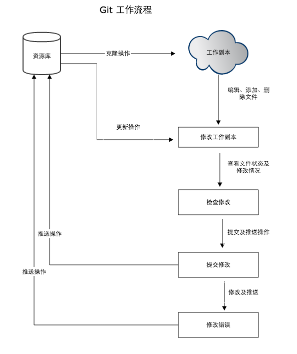
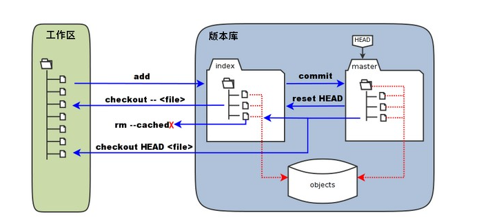
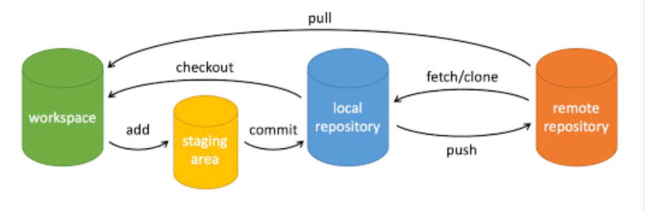
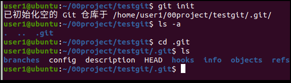

git的使用

1.git的安装

使用库安装：

sudo apt update

sudo apt-get install git

测试 git --version

2.git工作流程

概念

工作区：就是你在电脑里能看到的目录。
暂存区：英文叫 stage 或 index。一般存放在 .git 目录下的 index 文件（.git/index）中，所以我们把暂存区有时也叫作索引（index）。
版本库：工作区有一个隐藏目录 .git，这个不算工作区，而是 Git 的版本库。

3.git常用命令

1）git项目的创建

新建一个目录，在此目录下执行 git init

执行后i，会创建一个隐藏的.git目录

